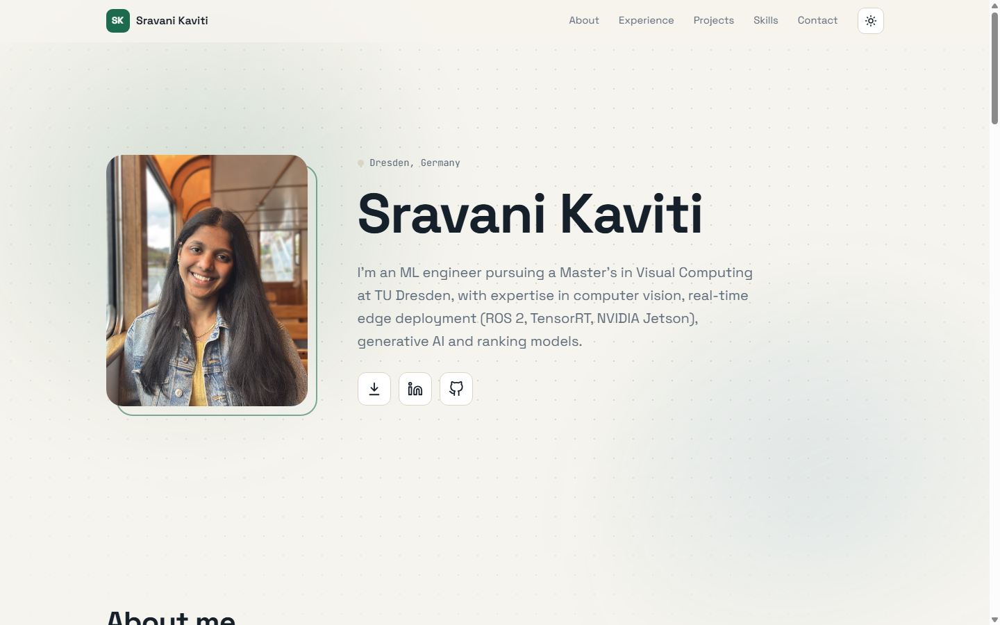

# Portfolio template

A clean, fast personal portfolio for engineers and researchers. Plain HTML, CSS and JavaScript: **no build step, no framework, no dependencies.** Edit one data file, push to GitHub, and it is live on GitHub Pages.

This is the site of [Sravani Kaviti](https://github.com/sravanikaviti13), published as a template. Fork it, replace the content with yours, and you are done.



## Features

- Hero with photo, name, short intro and icon links (CV, LinkedIn, GitHub)
- Light and dark theme, with a toggle that remembers the visitor's choice (light by default)
- Slow animated backdrop behind the hero and About section
- Experience as tabs, with optional grouped bullet points per role
- Projects as a swipeable carousel: three cards at a time on desktop, with arrows and dots
- A separate page for every project, with figures, metrics, tools and a link to the code
- Searchable skills, education, and a contact section where the email icon copies the address
- Responsive, keyboard accessible, and respects reduced-motion settings

## Quick start

1. Click **Use this template** (or **Fork**) on GitHub, then clone your copy.
2. Open `js/data.js` and replace everything with your own details. See [Customising](#customising).
3. Preview locally. Either open `index.html` in a browser or run a tiny server:

   ```bash
   python -m http.server 8000
   # then open http://localhost:8000
   ```

4. Push to GitHub and [turn on GitHub Pages](#deploy-on-github-pages).

## Customising

### 1. Your content: `js/data.js`

All text on the site comes from this one file.

| Key | What it controls |
|---|---|
| `profile` | Name, location, intro sentence, email and the GitHub, LinkedIn and CV links |
| `about` | Paragraphs and the small "right now" card in the About section |
| `experience` | Roles. Give each one either `bullets: [...]` or `groups: [{ title, bullets }]` |
| `projects` | Project cards and project pages (see below) |
| `skills` | Skill groups and the items in each group |
| `education` | Degrees, dates and notes |

A project looks like this:

```js
{
  id: "my-project",                 // used in the page URL: project.html?id=my-project
  title: "My Project",
  kicker: "Personal project · 2026", // small label above the title
  summary: "One or two sentences for the card.",
  metrics: [{ v: "95%", l: "accuracy" }, { v: "2x", l: "faster" }],
  stack: ["Python", "PyTorch"],
  repo: "https://github.com/you/my-project",   // optional: adds a "View code" button
  groups: [                                     // sections on the project page
    { title: "The problem", bullets: ["..."] },
    { title: "Results", bullets: ["..."] },
  ],
  images: [                                     // optional figures
    { src: "assets/projects/figure.png", caption: "What the figure shows." },
  ],
}
```

Use `details: ["...", "..."]` instead of `groups` for a single flat list. The order of the array is the order in the carousel.

### 2. Your files: `assets/`

| File | Replace with |
|---|---|
| `assets/Picture.JPG` | Your portrait. A 4:5 crop with your face in the upper part works best |
| `assets/Sravani_Kaviti_CV.pdf` | Your CV. Also update `profile.cv` in `js/data.js` if you rename it |
| `assets/favicon.svg` | Your own icon (the current one shows "SK") |
| `assets/projects/*` | Figures and screenshots for your projects |

### 3. Hard-coded text in the HTML

A few places are written directly in the HTML, so search for them and change them:

```bash
grep -rniE "sravani|SK<" index.html project.html css js
```

- `index.html`: the page `<title>`, the meta and Open Graph descriptions, and the "SK" logo mark and name in the header
- `project.html`: the same header, and the page description
- `assets/Picture.JPG` is referenced in `index.html`, and `data-theme="light"` on the `<html>` tag sets the default theme in both HTML files

### 4. Look and feel: `css/style.css`

Colours, fonts and radius are CSS variables at the top of the file (`--accent`, `--bg`, `--text` and so on). The dark palette is the base `:root` block, and the light palette overrides it under `:root[data-theme="light"]`. Change those two blocks and the whole site follows. The default theme is set by `data-theme="light"` on the `<html>` tag in `index.html` and `project.html`; change it to `"dark"` to flip the default.

## Deploy on GitHub Pages

1. Push your repository to GitHub.
2. Open **Settings → Pages**.
3. Under **Build and deployment**, choose **Deploy from a branch**, select `main` and `/ (root)`, and save.
4. After a minute your site is live at:
   - `https://<your-username>.github.io/<repo-name>/`, or
   - `https://<your-username>.github.io/` if the repository is named exactly `<your-username>.github.io`.
5. Show it on your repository page: click the gear next to **About**, paste the URL into **Website** (or tick **Use your GitHub Pages website**), and save.

All links in the site are relative, so it works under either URL without changes.

## Project structure

```
.
├── index.html        # home page
├── project.html      # one template for every project page (?id=...)
├── css/style.css     # all styles and theme variables
├── js/
│   ├── data.js       # all your content
│   ├── main.js       # home page behaviour
│   └── project.js    # project page rendering
├── assets/           # photo, CV, favicon, project figures
└── docs/preview.png  # screenshot used in this README
```

## Before you publish

- Replace the photo, CV, text and project figures. They belong to the original author (see below).
- Check what your CV PDF contains. A public repository and a public site make it downloadable by anyone, including any phone number or address on it.
- Remove or edit anything you do not want public: email address, employer names, unpublished results.

## License

The **code** (HTML, CSS and JavaScript) is released under the [MIT License](LICENSE). Use it, change it and ship it, including for your own portfolio. A link back is appreciated but not required.

The **personal content** is not covered by that licence and is not free to reuse: the portrait, the CV, the text in `js/data.js`, and the figures in `assets/projects/`. Please replace all of it with your own.
